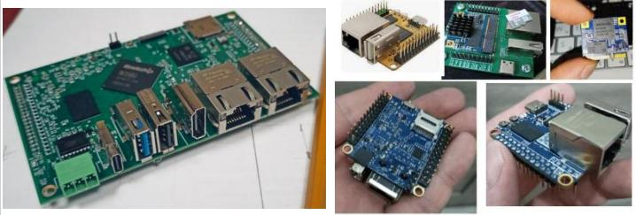

# OpenWrt for NapiLab Napi family

Production-ready OpenWrt builds for **NapiLab Napi** industrial IoT gateways based on Rockchip SoCs.

This repository contains all customizations needed to turn a vanilla OpenWrt snapshot into a fully functional industrial Modbus TCP gateway with a polished web interface.
---

## Supported hardware



### RK3308 platform (Napi-C / Napi-P / Napi-Slot)

| Board | SoC | RAM | Storage | Ethernet | Docs |
|-------|-----|-----|---------|----------|------|
| [NapiLab Napi-C](https://napiworld.ru/docs/napi-intro/) | RK3308 | 256/512MB | 4GB NAND — 32GB eMMC | 100Mbps | Industrial SBC |
| [NapiLab Napi-P](https://napiworld.ru/docs/napi-intro/) | RK3308 | 256/512MB | 4GB NAND — 32GB eMMC | 100Mbps | Industrial SBC |
| [NapiLab Napi-Slot](https://napiworld.ru/docs/napi-som-intro) | RK3308 | 256/512MB | 4GB NAND — 32GB eMMC | 100Mbps | SOM |

### RK3568 platform (Napi 2)

| Board | SoC | RAM | Storage | Ethernet | Docs |
|-------|-----|-----|---------|----------|------|
| [NapiLab Napi 2](https://napiworld.ru/) | RK3568 | 4GB DDR4 | 32GB eMMC + SD | 2x Gigabit | Industrial gateway |

> Board documentation, schematics, and design files: [napilab/napi-boards](https://github.com/napilab/napi-boards)

---

## Platform comparison

| Feature | Napi-C (RK3308) | Napi 2 (RK3568) |
|---------|----------------|-----------------|
| CPU | Cortex-A35 × 4, 1.3GHz | Cortex-A55 × 4, 2.0GHz |
| RAM | 256/512MB DDR3 | 4GB DDR4 |
| Ethernet | 1× 100Mbps | 2× Gigabit (LAN + WAN) |
| USB | 2× USB 2.0 | USB 2.0 + USB 3.0 OTG |
| RS-485 | UART1 (`/dev/ttyS1`) | UART7 (`/dev/ttyS7`), hardware RTS |
| CAN | — | CAN 2.0 |
| RTC | — | DS1338 on I2C5 |
| EEPROM | — | CAT24AA02 (256 bytes) on I2C5 |
| HDMI | — | HDMI 2.0 with framebuffer console |
| I2C | — | I2C4, I2C5 |
| Additional UART | — | UART3, UART4, UART5 (PLD) |
| Wi-Fi | RTL8723DS (802.11b/g/n) | — |
| NAT / Routing | — | Full router (LAN + WAN + NAT) |
| Console | Serial ttyS0, 1500000 baud | Serial ttyS2 + HDMI tty1 |
| MAC address | From RK3308 OTP | From eMMC CID |

---

## What's inside

### U-Boot

| Platform | U-Boot source |
|----------|---------------|
| RK3308 (Napi-C) | Custom `napic-rk3308_defconfig` based on Radxa ROCK Pi S |
| RK3568 (Napi 2) | NanoPi R5S defconfig (same RK3568 SoC) |

### Device Trees

| Platform | DTS file | Based on |
|----------|----------|----------|
| RK3308 | `rk3308-napi-c.dts` | Radxa ROCK Pi S |
| RK3568 | `rk3568-napi2-rk3568.dts` | Custom, Armbian-derived |

### Stable MAC address

**RK3308** — generated from OTP data:
```sh
MAC=$(cat /sys/bus/nvmem/devices/rockchip-otp0/nvmem | md5sum | \
  sed 's/\(..\)\(..\)\(..\)\(..\)\(..\)\(..\).*/02:\1:\2:\3:\4:\5/')
```

**RK3568** — generated from eMMC CID (OTP not available):
```sh
CID=$(cat /sys/class/block/mmcblk0/device/cid)
MAC=$(echo "$CID" | md5sum | sed 's/\(..\)\(..\)\(..\)\(..\)\(..\)\(..\).*/02:\1:\2:\3:\4:\5/')
WAN_MAC=$(echo "${CID}wan" | md5sum | sed 's/\(..\)\(..\)\(..\)\(..\)\(..\)\(..\).*/02:\1:\2:\3:\4:\5/')
```

### Network configuration

| Platform | LAN | WAN | Mode |
|----------|-----|-----|------|
| RK3308 | eth0 (DHCP) | — | Single interface |
| RK3568 | eth0 (192.168.1.1, static) | eth1 (DHCP) | Full router with NAT |

### HDMI console (Napi 2 only)

Napi 2 supports HDMI output with framebuffer console — kernel log and login prompt are displayed on an HDMI monitor. USB keyboard is supported for local access.

Kernel boot log is sent to both serial and HDMI simultaneously via custom bootscript (`console=tty1 console=ttyS2,1500000`).

DRM Rockchip VOP2 driver is built into the kernel with the following options:
- `DRM_ROCKCHIP=y`, `ROCKCHIP_VOP2=y`, `ROCKCHIP_DW_HDMI=y`
- `FRAMEBUFFER_CONSOLE=y`, `VT=y`

### First-boot configuration (uci-defaults)

| Script | RK3308 | RK3568 | Purpose |
|--------|--------|--------|---------|
| `70-rootpt-resize` | ✓ | ✓ | Resize root partition to fill storage (reboot) |
| `80-rootfs-resize` | ✓ | ✓ | Expand filesystem after partition resize (reboot) |
| `91-bash` | ✓ | ✓ | Set bash as default shell for root |
| `92-timezone` | ✓ | ✓ | Set timezone to MSK-3 |
| `93-console-password` | ✓ | ✓ | Enable password prompt on serial console |
| `94-macaddr` | OTP | eMMC CID | Generate stable MAC (LAN + WAN on RK3568) |
| `95-network` | eth0 only | eth0 LAN + eth1 WAN | Network configuration |
| `96-hostname` | `napiwrt` | `napi2wrt` | Set hostname |
| `97-luci-theme` | ✓ | ✓ | Set LuCI theme to openwrt-2020 |
| `98-usb-ethernet` | ✓ | — | USB Ethernet as WAN (RK3308 only) |
| `99-dhcp` | ✓ | — | DHCP on LAN (RK3308 only) |

### Pre-installed packages

**Industrial stack**
- `mosquitto` + `mosquitto-client` — MQTT broker
- `mbusd` + `luci-app-mbusd` — Modbus TCP gateway with web UI
- `mbpoll` + `luci-app-mbpoll` — Modbus CLI tool with web UI
- `mbscan` — Modbus device scanner

**1-Wire / DS18B20**
- `owfs`, `owserver`, `owfs-client` — 1-Wire bus support and device access

**I2C / GPIO**
- `i2c-tools`, `libi2c` — I2C bus diagnostics
- `gpiod-tools`, `libgpiod` — GPIO control via libgpiod

**Metrics collection**
- `collectd` + modules `mqtt`, `exec`, `network`, `rrdtool`, `modbus` — metrics collection and export

**USB-Serial adapters**
- `kmod-usb-serial-ch341`, `cp210x`, `ftdi`, `pl2303`

**LTE modem**
- `kmod-usb-net-qmi-wwan` + `uqmi` + `luci-proto-qmi` — Quectel EP06 support

**USB Ethernet**
- `kmod-usb-net-rtl8152` — RTL8152/8153 USB Ethernet adapter

**Disk management and partition resize**
- `parted`, `losetup`, `resize2fs`

**Networking and admin**
- `openssh-sftp-server` — SFTP access
- `luci-ssl-wolfssl` — HTTPS for LuCI
- `tcpdump`, `ethtool` — network diagnostics
- `bash`, `htop`, `nano`, `screen`, `tree`, `minicom` — admin tools
- `procps-ng`, `usbutils`, `lsblk` — system utilities

**C++ runtime**
- `libstdcpp` — required for native Node.js modules (Zigbee2MQTT)

**Napi 2 additional**
- `kmod-usb-hid`, `kmod-hid-generic` — USB keyboard for HDMI console
- `kmod-drm`, `kmod-fb` — DRM and framebuffer for HDMI output

---

## Repository structure

```
napi-openwrt/
├── napic-files/                    # RK3308 (Napi-C/P/Slot) customizations
│   ├── target/linux/rockchip/
│   │   ├── files/.../rk3308-napi-c.dts
│   │   └── image/armv8.mk
│   ├── package/
│   │   ├── luci-app-mbusd/
│   │   ├── luci-app-mbpoll/
│   │   └── mbscan/
│   ├── files/etc/uci-defaults/
│   └── .config
│
├── napi2-files/                    # RK3568 (Napi 2) customizations
│   ├── target/linux/rockchip/
│   │   ├── files/.../rk3568-napi2-rk3568.dts
│   │   ├── image/armv8.mk
│   │   └── image/napi2.bootscript
│   ├── package/
│   │   ├── luci-app-mbusd/
│   │   ├── luci-app-mbpoll/
│   │   └── mbscan/
│   ├── files/etc/
│   │   ├── uci-defaults/
│   │   ├── banner
│   │   ├── shadow
│   │   └── inittab
│   ├── apply-kernel-config.sh
│   └── .config
│
├── _arch/                          # Architecture docs
├── img/                            # Images for README
└── README.md
```

---

## luci-app-mbusd

Web interface for mbusd Modbus gateway — the crown jewel of this build.

- Start / Stop / Restart service
- Enable / Disable autostart
- Live process status with actual running parameters
- Listening IP:port display
- Full serial port and Modbus configuration

---

## Building

### Prerequisites (Ubuntu/Debian)

```bash
sudo apt install build-essential clang flex bison g++ gawk gcc-multilib \
  gettext git libncurses-dev libssl-dev python3-distutils python3-setuptools \
  python3-dev python3-pyelftools rsync swig unzip zlib1g-dev
```

### Setup

```bash
git clone https://github.com/openwrt/openwrt.git
cd openwrt
./scripts/feeds update -a
./scripts/feeds install -a
```

### Build for Napi-C (RK3308)

```bash
# Apply customizations
cp -r /path/to/napi-openwrt/napic-files/* .

# Build
make defconfig
make download -j$(nproc)
make -j$(nproc)
```

Output: `bin/targets/rockchip/armv8/openwrt-rockchip-armv8-napilab_napic-ext4-sysupgrade.img.gz`

### Build for Napi 2 (RK3568)

```bash
# Apply customizations
cp -r /path/to/napi-openwrt/napi2-files/* .

# Apply kernel config for HDMI console
bash apply-kernel-config.sh

# Build NanoPi R5S first (for U-Boot)
echo 'CONFIG_TARGET_rockchip_armv8_DEVICE_friendlyarm_nanopi-r5s=y' >> .config
make defconfig
make -j$(nproc)

# Switch to Napi 2
sed -i '/DEVICE_friendlyarm_nanopi-r5s/d' .config
echo 'CONFIG_TARGET_rockchip_armv8_DEVICE_napi2-rk3568=y' >> .config
make defconfig
make -j$(nproc)
```

Output: `bin/targets/rockchip/armv8/openwrt-rockchip-armv8-napi2-rk3568-ext4-sysupgrade.img.gz`

---

## Flashing

```bash
gunzip openwrt-*-sysupgrade.img.gz
dd if=openwrt-*-sysupgrade.img of=/dev/sdX bs=4M status=progress
```

---

## Default access

| Parameter | Napi-C (RK3308) | Napi 2 (RK3568) |
|-----------|----------------|-----------------|
| LAN IP | DHCP | 192.168.1.1 |
| WAN | — | eth1 (DHCP from provider) |
| Web UI | `http://<IP>/` | `http://192.168.1.1/` |
| SSH | `root@<IP>` | `root@192.168.1.1` |
| Console | ttyS0, 1500000 baud | ttyS2, 1500000 baud + HDMI |

---

## Zigbee2MQTT

This build supports running Zigbee2MQTT on OpenWrt. Since OpenWrt uses **musl libc**, the standard Node.js binaries won't work — a special musl/aarch64 build is required.

A pre-built archive is available in [Releases](https://github.com/lab240/napi-openwrt-build/releases):

```
zigbee2mqtt-2.9.1-openwrt-aarch64-musl.tar.gz
```

### Quick start

```bash
# Install Node.js (musl/arm64)
wget https://unofficial-builds.nodejs.org/download/release/v22.22.0/node-v22.22.0-linux-arm64-musl.tar.gz
mkdir -p /opt/node
tar xzf node-v22.22.0-linux-arm64-musl.tar.gz -C /opt/node --strip-components=1

# Install Zigbee2MQTT
mkdir /opt/zigbee2mqtt
tar xzf zigbee2mqtt-2.9.1-openwrt-aarch64-musl.tar.gz -C /opt/zigbee2mqtt/

# Install runtime dependency
apk add libstdcpp6

# Run
export PATH=/opt/node/bin:$PATH
cd /opt/zigbee2mqtt && npm start
```

Web UI available at `http://<IP>:8080/`

> Requires 512 MB RAM and ~500 MB free disk space. Mosquitto is already pre-installed in this build. 
---

## Changelog

### v1.1.0
- **NapiLab Napi 2 (RK3568) support** — new platform with dual Gigabit Ethernet, 4GB RAM
- Full router mode: LAN (192.168.1.1) + WAN (DHCP) + NAT
- HDMI framebuffer console with USB keyboard support — kernel log and login on monitor
- Dual console output: serial (ttyS2) + HDMI (tty1) simultaneously
- RS-485 on UART7 with hardware RTS direction control
- CAN 2.0 bus support
- Hardware RTC (DS1338) and EEPROM (CAT24AA02)
- Stable MAC address from eMMC CID (LAN + WAN)
- U-Boot from NanoPi R5S (same RK3568 SoC)
- Custom bootscript for dual console output
- DRM Rockchip VOP2 + DW-HDMI built into kernel

### v1.0.2
- Zigbee2MQTT 2.9.1 pre-built archive for musl/aarch64 available in Releases
- Automatic root partition and filesystem resize on first boot (scripts 70/80-rootpt-resize, double reboot)
- Disk management: `parted`, `fdisk`, `cfdisk`, `losetup`, `resize2fs`
- 1-Wire / DS18B20: `owfs`, `owserver`, `owfs-client`
- I2C: `i2c-tools`, `libi2c`
- GPIO: `gpiod-tools`, `libgpiod`
- Collectd: `collectd` + modules `mqtt`, `exec`, `network`, `rrdtool`, `modbus`
- C++ runtime: `libstdcpp`
- Utilities: `tree`, `fuse-utils`

### v1.0.1
- Automatic root partition resize on first boot (double reboot)
- Added packages: parted, fdisk, cfdisk, resize2fs, losetup

### v1.0.0
- Initial release for RK3308 (Napi-C/P/Slot)
- Custom U-Boot, DTS, uci-defaults
- mbusd + luci-app-mbusd
- Stable MAC from OTP

---

## Contact

For orders, integration inquiries, and custom builds: **dj.novikov@gmail.com**

---

## License

GPL-2.0 (following OpenWrt)