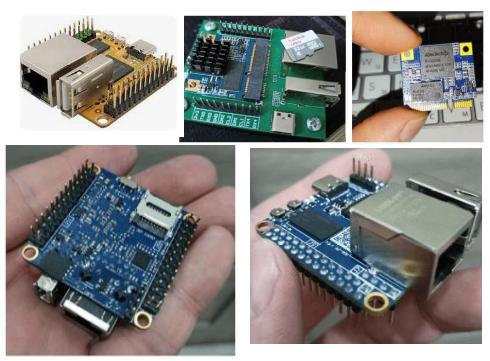

# OpenWrt for NapiLab Napi family (RK3308)

Production-ready OpenWrt build for **NapiLab Napi** industrial IoT SBC and SOM based on Rockchip RK3308 SoC.

This repository contains all customizations needed to turn a vanilla OpenWrt snapshot into a fully functional industrial Modbus TCP gateway with a polished web interface.

---



---

## Supported hardware

| Board | Storage | Docs |
|-------|---------|------|
| [NapiLab Napi-C](https://napiworld.ru/docs/napi-intro/) | 4GB NAND — 32GB eMMC | Industrial SBC |
| [NapiLab Napi-P](https://napiworld.ru/docs/napi-intro/) | 4GB NAND — 32GB eMMC | Industrial SBC |
| [NapiLab Napi-Slot](https://napiworld.ru/docs/napi-som-intro) | 4GB NAND — 32GB eMMC | SOM |
| [Radxa ROCK Pi S](https://wiki.radxa.com/RockpiS) | — | Community board, same RK3308 SoC |

> All boards share the same Rockchip RK3308 SoC — one firmware to rule them all.

---

## SoC features

| Component | Details |
|-----------|---------|
| SoC | Rockchip RK3308 (quad-core ARM Cortex-A35, 1.3GHz) |
| RAM | 256MB / 512MB DDR3 |
| Storage | 4GB NAND up to 32GB eMMC |
| Ethernet | 100Mbps (GMAC + RTL8201F PHY) |
| USB | 2x USB 2.0 Host |
| UART | 3x UART (ttyS0 console, ttyS1, ttyS2) |
| Wi-Fi | RTL8723DS (802.11b/g/n) |

---

## What's inside

### U-Boot
- Added `napic-rk3308` U-Boot variant based on Radxa ROCK Pi S (same RK3308 hardware)
- Custom `napic-rk3308_defconfig` patch

### Device Tree
- Custom DTS `rk3308-napi-c.dts` based on ROCK Pi S
- UART1 → `/dev/ttyS1` (RS485 via mbusd)
- UART2 → `/dev/ttyS2`
- Bluetooth disabled

### Stable MAC address
Generated deterministically from RK3308 OTP data — same MAC across reboots on every board:

```sh
MAC=$(cat /sys/bus/nvmem/devices/rockchip-otp0/nvmem | md5sum | \
  sed 's/\(..\)\(..\)\(..\)\(..\)\(..\)\(..\).*/02:\1:\2:\3:\4:\5/')
```

### First-boot configuration (uci-defaults)

| Script | Purpose |
|--------|---------|
| `91-bash` | Set bash as default shell for root |
| `92-timezone` | Set timezone to MSK-3 |
| `93-console-password` | Enable password prompt on serial console |
| `94-macaddr` | Generate stable MAC from OTP |
| `95-network` | Configure eth0 without bridge |
| `96-hostname` | Set hostname to `napiwrt` |
| `97-luci-theme` | Set LuCI theme to openwrt-2020 |
| `99-dhcp` | DHCP configuration |

### Pre-installed packages
- `mosquitto` + `mosquitto-client` — MQTT broker
- `mbusd` + `luci-app-mbusd` — Modbus TCP gateway with web UI
- `mbpoll` — Modbus CLI tool
- `kmod-usb-serial-ch341`, `cp210x`, `ftdi`, `pl2303` — USB-Serial adapters
- `kmod-usb-net-qmi-wwan` + `uqmi` — LTE modem support (Quectel EP06)
- `openssh-sftp-server` — SFTP access
- `bash`, `htop`, `nano`, `screen`, `tcpdump`, `ethtool` — admin tools
- `luci-ssl-wolfssl` — HTTPS for LuCI

---

## luci-app-mbusd

Web interface for mbusd Modbus gateway — the crown jewel of this build.

- Start / Stop / Restart service
- Enable / Disable autostart
- Live process status with actual running parameters
- Listening IP:port display
- Full serial port and Modbus configuration

→ See [luci-app-mbusd](https://github.com/YOUR_USERNAME/luci-app-mbusd) repository

---

## Building

### Prerequisites (Ubuntu/Debian)

```bash
sudo apt install build-essential clang flex bison g++ gawk gcc-multilib \
  gettext git libncurses-dev libssl-dev python3-distutils rsync unzip zlib1g-dev
```

### Setup

```bash
git clone https://github.com/openwrt/openwrt.git
cd openwrt
./scripts/feeds update -a
./scripts/feeds install -a
```

### Apply customizations

```bash
tar xzf napic-openwrt-YYYYMMDD-HHMM-v1.0.tar.gz -C /path/to/openwrt/
```

### Build U-Boot

```bash
make package/boot/uboot-rockchip/compile VARIANT=napic-rk3308 -j$(nproc)
```

### Build image

```bash
make -j$(nproc)
```

Output: `bin/targets/rockchip/armv8/openwrt-rockchip-armv8-napilab_napic-ext4-sysupgrade.img.gz`

---

## Flashing

```bash
gunzip openwrt-rockchip-armv8-napilab_napic-ext4-sysupgrade.img.gz
dd if=openwrt-rockchip-armv8-napilab_napic-ext4-sysupgrade.img of=/dev/sdX bs=4M status=progress
```

---

## Default access

| Parameter | Value |
|-----------|-------|
| IP | DHCP (stable MAC ensures consistent lease) |
| Web UI | `http://<IP>/` → LuCI |
| SSH | `root@<IP>` |
| Console | ttyS0, 1500000 baud |

---

## License

GPL-2.0 (following OpenWrt)